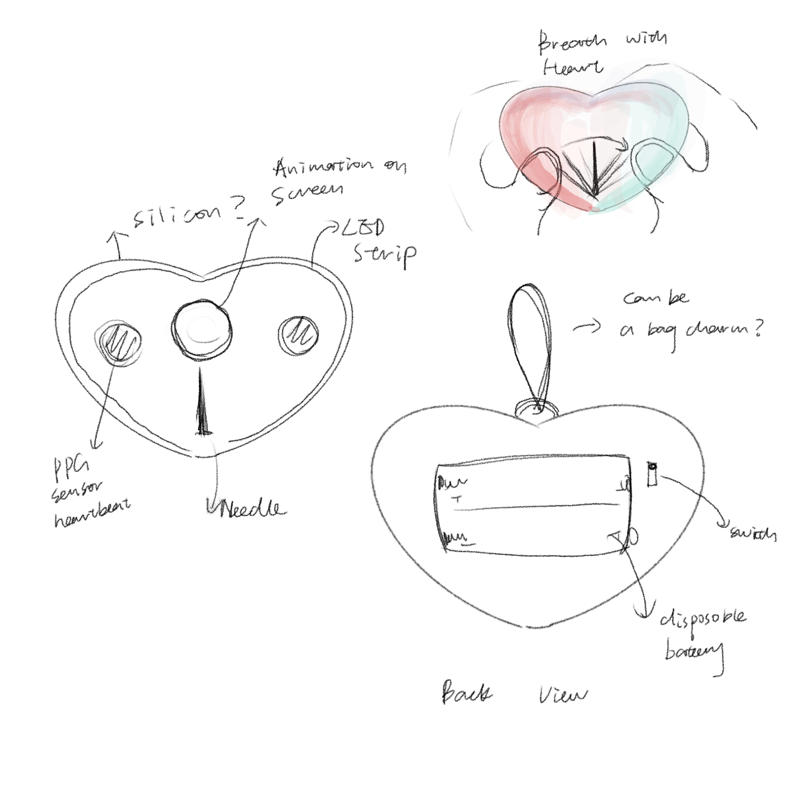

# HWSW_Final_Project
## Breathe with Heart
## **Introduction**

This device is designed to help people reduce anxiety during a panic attack by guiding them to breathe mindfully. It tracks the user’s heartbeat in real-time and provides feedback (such as dimming lights) to prompt users to practice breathing meditation.
- LED light: Display users' anxiety level and suggest breathing tempo.
- Stepper Gauge Needle: Display users' anxiety level.

## **Sensor**

**PPG(photoplethysmography)-MAX30102** is chosed for this project. The sensor senses changes in blood flow caused by heartbeats using light absorption. It calculates:
- **Heart Rate (BPM)**
- **Heart Rate Variability (HRV)** for stress analysis.
- Optionally, **oxygen saturation (SpO2)** and **perfusion index (PI)**

When user hold the device with their hands, the sensor will be sensing their thumbs to progress the data to ESP32 and analyse users' status.

## **Display**

- **RGB LED Strip**
This color of the RGB LED display the user's anxiety level from green to red. The brightness of the light changes along with the suggested breathing tempo.
- **Stepper Gauge Needle**
This needle display users' anxiety percentage according to the calculated **HRV**.

## **Diagram**

- How it will work

- Systems Architecture Diagram

